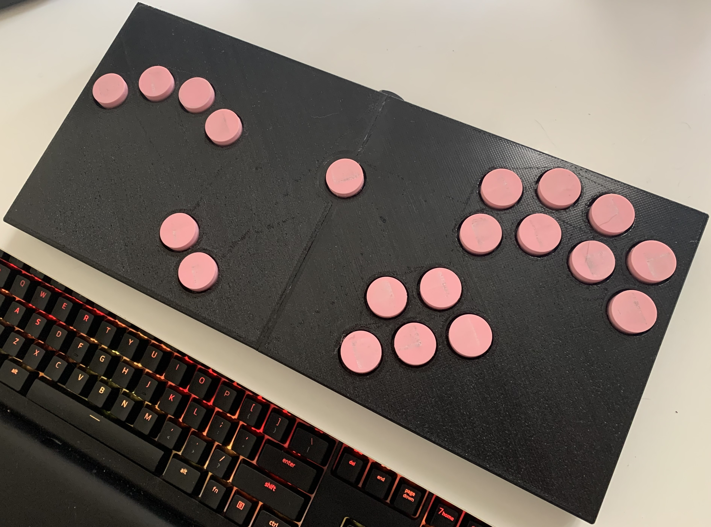
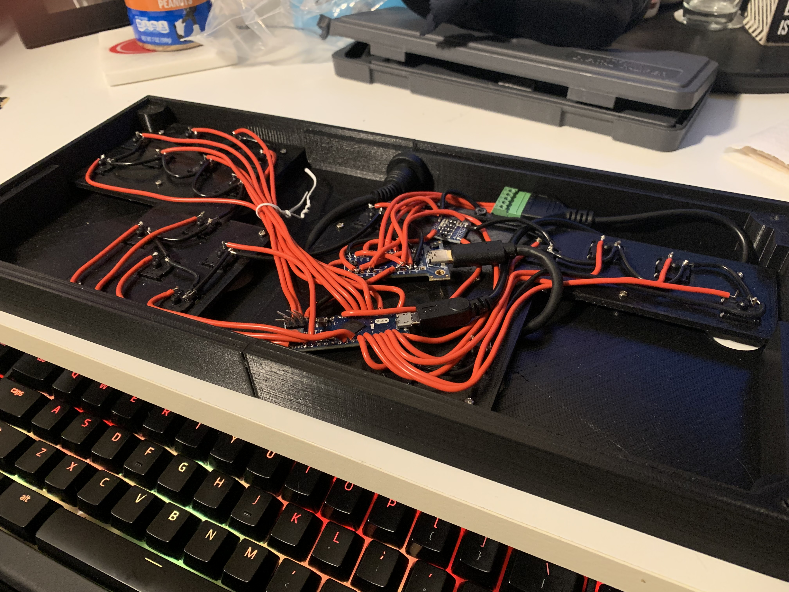

## Custom "b0xx" Style Controller

**Project Goal:** To design and build a custom rectangular "b0xx" style controller that offers enhanced precision and ergonomics, providing a competitive alternative to traditional GameCube controllers for the Super Smash Bros. series.

**Overview:**
This project involved the complete fabrication of a custom smash controller, from 3D modeling and printing the enclosure to integrating the internal electronics and leveraging open-source firmware. The goal was to create a controller that not only feels comfortable for extended play sessions but also provides a significant advantage in competitive play through its precise button layout.

**Key Features & Development Process:**

* **Ergonomic Design & 3D Printing:** The core of this controller is its custom-designed rectangular enclosure. I meticulously 3D modeled the case to achieve optimal ergonomics for a "b0xx" style layout, considering hand positioning and button access. The enclosure was then 3D printed, providing a durable and lightweight housing for the internal components.
* **Precision Button Layout:** The controller features a unique arrangement of 22 pink, low-profile buttons. This specific layout is designed to minimize hand movement and maximize input speed and accuracy, crucial for high-level Smash Bros. gameplay.

* **Internal Wiring & Integration:** As seen in the "B0xx internals.jpg" image, the internal wiring was carefully managed to ensure clean connections and reliable performance. Each button is wired to a central PCB, which is then connected to a custom firmware that translates button presses into GameCube controller inputs.

* **Open-Source Software Integration:** This project leveraged existing open-source controller firmware, allowing for seamless plug-and-play compatibility with Nintendo Switch and Wii U consoles running Smash Bros. This also allowed for customizability and optimization of button mapping and input sensitivity.
* **Alternative to Traditional Controllers:** The "b0xx" style controller offers a distinct tactile experience compared to the traditional GameCube controller. Its flat, button-only interface can reduce strain on the wrists and fingers, making it a preferred choice for many competitive players seeking a more precise and comfortable input method.

**Outcome:**
The result is a fully functional and highly performant custom smash controller that meets the demands of competitive play. This project demonstrates skills in 3D design and printing, electronics integration, and the ability to utilize and adapt open-source solutions to create a specialized peripheral. It stands as a testament to the benefits of custom hardware in enhancing gaming performance and personalizing the player experience.
